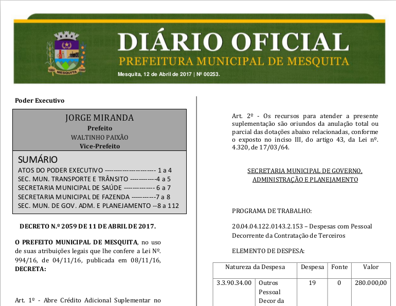
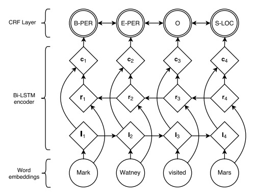

---
# to compile you need xelatex and pandoc
# run pandoc -t beamer -o DOnn.pdf -is --latex-engine=xelatex presentation.md
author: "joão carabetta, lucas carneiro, bruno cuconato"
title: "NER in Brazilian Portuguese"
subtitle: "training a NER tagger for use in DOs"
institute: "EMAp"
header-includes: 
    - \usepackage{polyglossia} 
    - \setmainlanguage{portuges}
    - \usepackage{hyperref}
    - \hypersetup{colorlinks=true, linkcolor=blue, linkbordercolor=blue}
---

# Named Entity Recognition for Brazilian Portuguese

## overview

- we trained a neural network using Theano

- we used as training and test sets the CoNLL-U files released by
  floresta sintá(c)tica, a Portuguese research project [^floresta]

- the input corpus has some 10K sentences from Folha de S. Paulo and
  the Portuguese newspaper Público, fully revised by linguists

[^floresta]: http://www.linguateca.pt/floresta/corpus.html

# motivation

## the intent was to be able to recognize entities in Prefeitura de Mesquita's public register (Diário Oficial, D.O.)[^mes]

[^mes]:http://transparencia.mesquita.rj.gov.br/

# crawling PDF DOs

- crawled some 200 webpages for all the DOs published this year

# DOs PDF



# extracting text from PDFs

- several tools available, none up to the task

- `pdftotext`: GNU/Linux shell utility
    
    - fast
    
    - not very intelligent

# pdftotext

> Mesquita, 12 de Abril de 2017 | Nº 00253.

> Poder Executivo
> 
> JORGE MIRANDA
> 
> Art. 2º - Os recursos para atender a presente
> suplementação são oriundos da anulação total ou
> parcial das dotações abaixo relacionadas, conforme
> o exposto no inciso III, do artigo 43, da Lei nº.
> 4.320, de 17/03/64.
> 
> Prefeito
> WALTINHO PAIXÃO
> Vice-Prefeito
> 
> SUMÁRIO
> SECRETARIA MUNICIPAL DE GOVERNO,
> ADMINISTRAÇÃO E PLANEJAMENTO
> 
> ATOS DO PODER EXECUTIVO ----------------------- 1 a 4
> SEC. MUN. TRANSPORTE E TRÂNSITO ------------4 a 5
> SECRETARIA MUNICIPAL DE SAÚDE -------------- 6 a 7
> SECRETARIA MUNICIPAL DE FAZENDA -----------7 a 8
> SEC. MUN. DE GOV. ADM. E PLANEJAMENTO --8 a 112
> 
> PROGRAMA DE TRABALHO:
> 
> DECRETO N.º 2059 DE 11 DE ABRIL DE 2017.

# extracting text from PDFs

- `PDFminer`: Python library

    - more intelligent, but very slow

    - still not intelligent enough

# preparing train/test set

## the CoNLL-U format

CoNLL-U[^con] files are plain text files (UTF-8, using only the LF character
as line break) with three types of lines:

1. Word lines containing the annotation of a word/token in 10 fields
   separated by single tab characters; see below.
2. Blank lines marking sentence boundaries.
3. Comment lines starting with hash (#).

[^con]: http://universaldependencies.org/format.html

# the CoNLL-U format

Sentences consist of one or more word lines, and word lines contain
the following fields:

1. ID: Word index, integer starting at 1 for each new sentence; may be
   a range for multiword tokens; may be a decimal number for empty
   nodes.
2. FORM: Word form or punctuation symbol.
3. LEMMA: Lemma or stem of word form.
4. UPOSTAG: Universal part-of-speech tag.
5. XPOSTAG: Language-specific part-of-speech tag; underscore if not
   available.

# the CoNLL-U format

6. FEATS: List of morphological features from the universal feature
   inventory or from a defined language-specific extension; underscore
   if not available.
7. HEAD: Head of the current word, which is either a value of ID or
   zero (0).
8. DEPREL: Universal dependency relation to the HEAD (root iff HEAD = 0) or a defined language-specific subtype of one.
9. DEPS: Enhanced dependency graph in the form of a list of
   head-deprel pairs.
10. MISC: Any other annotation.

# the CoNLL-U format

```
# text = PT no governo
# source = CETENFolha n=1 cad=Opinião sec=opi sem=94a
# sent_id = CF1-1
# id = 1
1	PT	PT	PROPN	PROP|M|S|@NPHR	Gender=Masc|Number=Sing	0	root	_	_
2-3	no	_	_	_	_	_	_	_	_
2	em	em	ADP	<sam->|PRP|@N<	_	4	case	_	_
3	o	o	DET	<-sam>|<artd>|ART|M|S|@>N	Definite=Def|Gender=Masc|Number=Sing|PronType=Art	4	det	_	_
4	governo	governo	NOUN	<np-def>|N|M|S|@P<	Gender=Masc|Number=Sing	1	nmod	_	_
```

# preparing train/test set

## convert from CoNLL-U to two column format

```
«	0
Câmera	B-PROPN
Manchete	I-PROPN
»	0
é	0
o	0
nome	0
de	0
o	0
novo	0
programa	0
jornalístico	0
que	0
estréia	0
quarta-feira	0
,	0
a	0
as	0
22h30	0
,	0
em	0
a	0
Rede	B-PROPN
Manchete	I-PROPN
.	0
```

# preparing train/test set

## problems

- POS tags did not discriminate the kind of proper noun found;

- CoNLL-U is now (as of 2016) a well specified format, but in 2008 (when
  these files were made), there was still plenty of room for
  improvement

    - the input files had some inconsistencies that had to be
      corrected by hand

# training a NN

- Name entity recognition with supervised learning

- It learns from a small corpora (as is common in linguistics)

- Language independent

- no resort to gazetteers

[^nn]: https://arxiv.org/pdf/1603.01360.pdf

# Name Evidence

- orthographic evidence (how does the name look like?)

- distributional evidence (where does the word tend to occur?)

# Model

- bidirectional LSTM with a sequential conditional random layer above
it (LSTM-CRF)

- Learns from recent inputs and preserve long-range dependencies CRF -
Conditional Random Field

- With the results of the LSTM, it tags the tokens according to its
  neighbourhood

# Model



# Model results

- accuracy: 99.06%

- precision: 94.23%

- recall: 92.49%

- F-score: 93.25%


# testing on DO files

- because the extracted tests were not perfect, we manually built a
  test suite, with 35-odd *atos*

- preprocessing

- we ran the NN on this test suite

# testing on DO files

- raw input: several atos separated by `---`

- processed input is a sentence per line, one additional newline was
  added to separate one ato from another

# testing on DO files

    SECRETARIA MUNICIPAL DE EDUCAÇÃO PORTARIA Nº 394/2017 Dispõe sobre a instituição da comissão de fiscalização do CONTRATO ADMINISTRATIVO Nº 005/2017 , processo administrativo nº 01/0015/17 , firmado entre o Município de Mesquita e COOTRAB Cooperativa Central de Trabalho Ltda. , tendo como objeto a prestação de serviço de apoio complementar as atividades desenvolvidas pela Secretaria Municipal de Educação nas áreas de zeladoria , controle de acesso e conservação .
     O SECRETÁRIO MUNICIPAL DE EDUCAÇÃO , no uso de suas atribuições legais , e ; Considerando , o disposto na Instrução Normativa nº 003/2015 , da Controladoria Geral do Município , que estabelece procedimentos para a execução das atividades de fiscalização e acompanhamento dos contratos , aditivos , convênios e dos termos celebrados pelo Município de Mesquita .
     RESOLVE : Art.1° Designar os servidores abaixo relacionados , para integrar a Comissão de Fiscalização do CONTRATO ADMINISTRATIVO Nº 005/2017 , supracitado .
    · Isabelle da Cruz e Silva Guimarães – Mat.11/003.398-7 · Adjemir Marques da Silva Neto – Mat.11/008.117-5 Art.2° Esta portaria entra em vigor na data de sua publicação .
    Thaís dos Santos Lima Secretário Municipal de Educação
     
    RESOLUÇÃO CMDCA Nº 003 / 2017 .
    Dispõe sobre a nova composição das Comissões de Trabalho do Conselho Municipal dos Direitos da Criança e do Adolescente de Mesquita .
    O CONSELHO MUNICIPAL DOS DIREITOS DA CRIANÇA E DO ADOLESCENTE – CMDCA , no uso das atribuições conferidas pela Lei Municipal nº 014 de 07 de Maio de 2001 e Decreto de nº 025 de 09 de julho de 2001 , com base no Regimento Interno , Resolução nº 004 , de 21 de Maio de 2013 e : Considerando a deliberação da Reunião Ordinária do CMDCA , realizada em 13 de Março de 2017 , às 14 horas , na Sala dos Conselhos da Semas , RESOLVE : Art .
    1º – Tornar público a nova composição das Comissões de Trabalho do Conselho Municipal dos Direitos da Criança e do Adolescente de Mesquita , a seguir : COMISSÃO DE POLÍTICAS PÚBLICAS : Representantes governamentais : Erika Rangel de Souza dos Santos ; Ruan Carlos Silva de Melo .
    Representantes da Sociedade Civil : Bruna Simãozinho Carvalho Morais ; Vinicius Horácio Pinto Guião .
    Art .
    2º - A Comissão de Políticas Públicas possui o acréscimo de mais 02 ( dois ) conselheiros de forma paritária , a saber : Fernandes de Moraes Silva ; e Anderson da Silva Pereira , que fiscalizará e dará suporte às ações do Conselho Tutelar de Mesquita , conforme o artigo 9º da Resolução 004/2013 , que dispõe sobre o Regimento Interno do CMDCA ; COMISSÃO DE NORMASE REGISTROS : Representantes Governamentais : Rafael ; João Carlos de Oliveira .
    Representantes da Sociedade Civil : Bruna Simãozinho Carvalho Morais ; Andressa Souza .
    Comissão de Administração do Fundo Municipal Para a Infância e Adolescência – COFIMIA : Representantes Governamentais : Fernandes de Moraes Silva ; Erika Rangel de Souza Santos Representantes da Sociedade Civil : Anderson da Silva pereira ; Bruna Simãozinho Carvalho Morais .

# results

- output is `token__tag`

    - tag can be one of `B-PROPN`, `I-PROPN`, `O`

# results

    O__O PREFEITO__B-PROPN MUNICIPAL__I-PROPN DE__I-PROPN
    MESQUITA__I-PROPN ,__O Estado__B-PROPN do__I-PROPN Rio__I-PROPN
    de__I-PROPN Janeiro__I-PROPN ,__O Sr.__O JORGE__B-PROPN
    MIRANDA__I-PROPN ,__O no__O uso__O de__O suas__O atribuições__O que__O
    lhe__O confere__O o__O art__O .__O 94__O ,__O IV__O ,__O da__O Lei__O
    Orgânica__B-PROPN Municipal__I-PROPN ,__O e__O nos__O termos__O do__O
    art__O .__O

# results

- the NER tagger seems to rely too much on Capital Letters

- as it was trained on journalistic texts and not on DOs, it is not
  used to their extensive use of Capital Letters

# results

        CONVOCAÇÃO__B-PROPN PARA__I-PROPN REUNIÃO__I-PROPN ORDINÁRIA__I-PROPN
        O__O CONSELHO__B-PROPN MUNICIPAL__I-PROPN DE__I-PROPN
        ASSISTÊNCIA__I-PROPN SOCIAL__I-PROPN ,__O CONVOCA__B-PROPN seus__O
        conselheiros__O titulares__O

# next steps

- the model performs well even though the train set is very different
  from its use set
  
- so the natural next step is to manually annotate DOs, so that the
  model can learn its idiosyncrasies

- as it was shown, the train set does not have to be very big, so it
  might be feasible
  
# repository

[Github](https://github.com/alunos-mestrado-emap/entity-recognition-DO)
